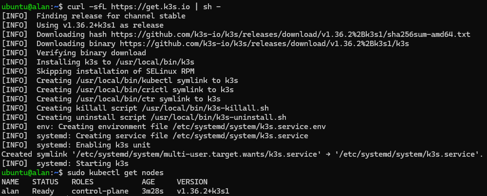

# Setting up k3s and installing Helm

## Setting up k3s

The first thing you need to do is set up a virtual machine, this will be used as Control Plane for the k3s cluster (read the note below).
For a guide on how to create a virtual machine or an LXC container, check [how to deploy a container](../how-to/deploy-container.md).

!!! note
    It is recommended to use a virtual machine to install k3s, using an LXC container would most probably bring issues.

To install k3s, you just have to execute the command:

```bash
curl -sfL https://get.k3s.io | sh -
```

To verify a successful installation, you can launch some simple command like:
```bash
sudo kubectl get nodes
```

The whole output should look like this:


## Configuring kubectl access

k3s writes its kubeconfig file to `/etc/rancher/k3s/k3s.yaml`, readable only
by root. This step configures kubectl access for your regular user, and is
required for the following sections of this guide, where Helm needs to reach
the cluster without using `sudo`.

Copy the kubeconfig to the default location and fix its ownership:

```bash
mkdir -p ~/.kube
sudo cp /etc/rancher/k3s/k3s.yaml ~/.kube/config
sudo chown $USER:$USER ~/.kube/config
```

On k3s, `kubectl` is usually a symlink to the k3s binary itself, which does
**not** fall back to `~/.kube/config` like standard `kubectl` does. You must
also export `KUBECONFIG` explicitly, or commands will keep failing with a
permission error even after copying the file:

```bash
echo 'export KUBECONFIG=$HOME/.kube/config' >> ~/.bashrc
source ~/.bashrc
```

Verify it worked:

```bash
kubectl get nodes
```

The output should be the same as before.

## Installing Helm

To install Helm execute:

```bash
curl https://raw.githubusercontent.com/helm/helm/main/scripts/get-helm-3 | bash
```