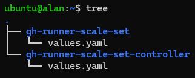
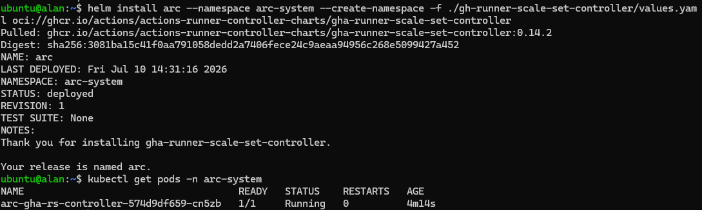
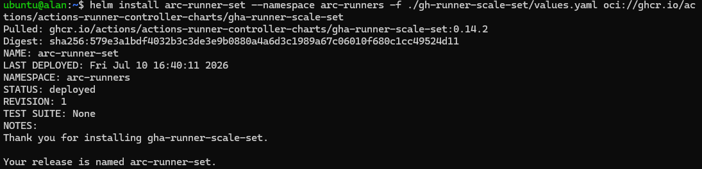

# Actions Runner Controller

## Introduction to ARC

Installing ARC requires two different Helm charts:

- `gha-runner-scale-set-controller`; the first Helm chart that needs to be installed, it contains all the control components required to manage runner scale sets and the controller pod. It is typically installed once per cluster.  
- `gha-runner-scale-set`; it creates a specific runner scale set instance. Multiple runner scale sets can be installed in the same cluster, each with its own configuration.

For more information about how ARC works, check out the [documentation](https://docs.github.com/en/actions/concepts/runners/actions-runner-controller).

## Installing ARC

!!! note
    The names of folders, files or namespaces from now on are arbitrary.

Create a directory named `gh-runner-scale-set-controller`:

```bash
mkdir gh-runner-scale-set-controller
```

Move into the directory:

```bash
cd gh-runner-scale-set-controller
```

Copy and paste here the `values.yaml` file of the `gh-runner-scale-set-controller` chart. You can find it [here](https://github.com/actions/actions-runner-controller/tree/master/charts/gha-runner-scale-set-controller), or just search for the GitHub repository of the project and find it yourself.

You can now go back to the parent directory and do the same thing for the `gha-runner-scale-set` chart ([here](https://github.com/actions/actions-runner-controller/tree/master/charts/gha-runner-scale-set)). Your directory structure should look like this:



Now we have everything we need and can dive into the configuration of the `values.yaml` files.

### Installation of the controller

For the controller chart, all the default values in the `values.yaml` are fine and it is not necessary to make any changes. So we can go ahead and install the Helm chart:

```bash
helm install arc --namespace arc-system --create-namespace \
-f ./gh-runner-scale-set-controller/values.yaml \
oci://ghcr.io/actions/actions-runner-controller-charts/gha-runner-scale-set-controller
```

!!! note
    In this guide, the two charts will be installed in two different namespaces, in this case it's called `arc-system`. Also make sure the path specified after the -f flag is correct.

After the installation, to verify if everything is running correctly, run:

```bash
kubectl get pods -n arc-system
```

A successful installation should look like this:



!!! note
    It's normal to see only the controller pod, the listener will be created only after the installation of the second chart.

### Installation of the runner scale set

The runner scale set chart requires some basic configuration to run correctly. Inside the `values.yaml`, the following fields must be modified:

- `githubConfigUrl`; the URL of the repository, organization, or enterprise where you want to register the runners.
- `githubConfigSecret`; specifies how to authenticate with GitHub. Three authentication methods are available:
    - A Personal Access Token (PAT)
    - A GitHub App
    - A pre-existing Kubernetes Secret
- `minRunners` and `maxRunners`; here you can specify the minimum number of runners to keep idle and the maximum number of runners that can be created when scaling up. If you don't specify a maximum value, the system will scale up until the cluster runs out of available resources.
- `runnerScaleSetName`; the name that will be used inside the workflows to identify the ARC group of runners.
- `containerMode`; specify how the runners should handle jobs that use containers or Docker commands. Since the runner runs as a container inside a Kubernetes pod, it has some important limitations regarding these types of jobs. This configuration provides three ways to workaround this issue:
    - `dind`; inside each pod is created a second container running Docker-in-Docker (DinD). This is the most flexible option, as you have no limitations on what you can do inside your jobs. On the other hand, it also uses more resources than needed since the system will always spin up the dind container, even though the running job doesn't need it.
    - `kubernetes`; in this mode if a job requires to be executed inside a container,  ARC communicates directly with the Kubernetes API and creates a dedicated pod. It's a smart workaround since it creates the second pod only if needed, avoiding wasting resources. However it does not support Docker commands.
    - `kubernetes-novolume`; a variant of the kubernetes mode that avoids using shared volumes between the runner Pod and the job Pod. It is useful in environments where shared volumes are not available or are not desired.

In this guide as `containerMode` we are going to use `dind`, since it is the most flexible option. The authentication is configured using a Kubernetes Secret containing the credentials of a GitHub App. This is the recommended method for ARC because it provides fine-grained permissions, avoids the use of long-lived PATs and avoids hardcoding your GitHub App credentials inside the `values.yaml` file.  
First you need to create the namespace where the chart will be installed:

```bash
kubectl create namespace arc-runners
```

Now you can create your secret filling in with your credential. If you don't know how authentication with a GitHub App works, check the [Authenticating with a GitHub App](./04-authentication-with-github-app.md) page.

```bash
kubectl create secret generic github-app-authentication \
--namespace=arc-runners --from-literal=github_app_id="..." \
--from-literal=github_app_installation_id="..." \
--from-literal=github_app_private_key="$(cat ...)"
```

Fill the remaining fields (`githubConfigUrl`, `minRunners`, `maxRunners`, `runnerScaleSetName`) as needed.

Now we are ready to install the runner scale set chart:

```bash
helm install arc-runner-set --namespace arc-runners \
-f ./gh-runner-scale-set/values.yaml \
oci://ghcr.io/actions/actions-runner-controller-charts/gha-runner-scale-set
```
The output should be:



To verify that the system is running correctly, run:

```bash
kubectl get pods -n arc-system
```

Now in addition to the controller pod you should also see the listener pod.

Lastly, to check if the runners has been succesfully created:

```bash
kubectl get pods -n arc-runners
```

You should see something like this (depending on the minimum number of runners that you specified):

```bash
NAME                                     READY   STATUS    RESTARTS   AGE
self-hosted-runners-ll5dq-runner-629wg   2/2     Running   0          5d20h
self-hosted-runners-ll5dq-runner-8ldg2   2/2     Running   0          5d20h
self-hosted-runners-ll5dq-runner-pxjh4   2/2     Running   0          5d20h
```

If everything is fine, the last test you should do is run some workflows and see how the system behaves.