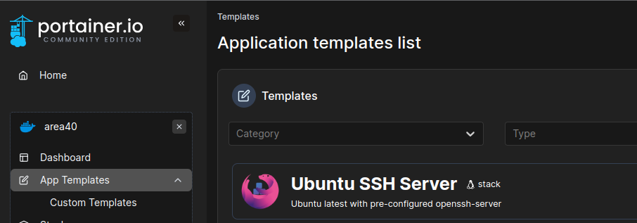
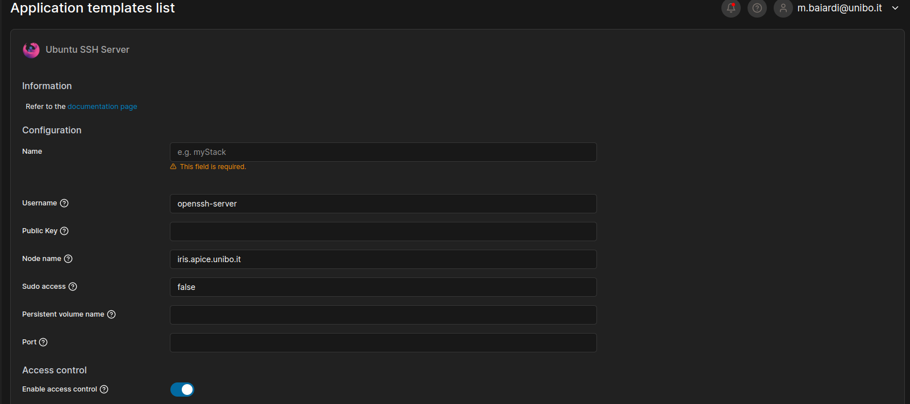

# Deploy an Open SHH server container
The Portainer platform offers several pre-configured Stacks that can be deployed in the cluster, this is the case for example of `Ubuntu SSH Server`. 

## How to use it
Click on the entry of the template you want to deploy in the cluster, and then add the required information inside the form. 
When you added all the information requires, you can finally click on Deploy the stack.

The required informations are: 

1. Your Stack's name: which must follows the [Good Practices](../good-practices.md).
2. The username to log into the machine using SSH. 
3. Your SSH Public Key. You can create your public-private SSH keys by using the command `ssh-keygen` on unix-based systems.
4. The hostname of the server on which the container will be deployed, choose one among the available ones in the cluster.
5. A flag to enable sudo access to your SSH account into the container.
6. Your persistent volume name. It will be mounted under the folder `/persistent` in the container.
7. The port on which expose the service. 

!!!note
    Note that the exposed port should not be one of the frequently used by known services (take a look at [this](https://en.wikipedia.org/wiki/List_of_TCP_and_UDP_port_numbers)).

!!!warning
    If one of these information is missing, the container won't deploy correctly on the cluster.

!!!warning
    If you want to save your data in the persistent volume, you have to save it under the `/persistent` folder, otherwise it will be lost after a container restart.
