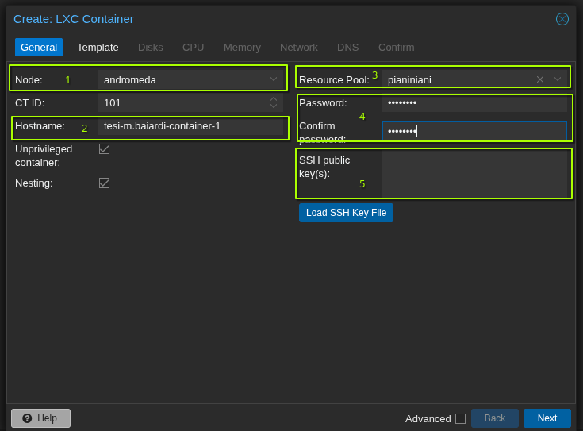

# How to deploy a container

After accessing the platform, 
you can find two buttons in the top right corner of the web ui, one for creating a container `Create CT` and another one for creating a virtual machine `Create VM`.
Clicking on the `Create CT` button, you will be asked to configure your LXC container.
If you never used an LXC container before, you can read the [LXC Introduction](https://linuxcontainers.org/lxc/introduction/).

In the `General` tab, you will be asked to provide:

1. The node of the cluster on which you want to deploy the container. You can choose any node, but consider that if you choose a node with few resources, your container will have few resources available.
2. The hostname of the container, this is the name that will be used to identify the container inside of the cluster. 
    !!!note
        It is recommended to use a unique hostname for each container, to avoid conflicts with other containers. A good practice is to use the following format: `<name>.<surname>-<purpose>`, for instance `m.baiardi-experiment-network`. In this way, we can easily identify the owner of the container and its purpose. The hostname is also used to access the container through the network.
3. The resource pool of the container, this is the resource pool assigned from your supervisor. You can only deploy containers in the resource pool assigned to you, and you can only see the containers deployed in that resource pool.
4. The password for the container, this is the root password configured in the container.
5. You can also provide a SSH public key, in this way you can access the container using SSH without providing a password. This is the recommended way to access the container, since it is more secure than using a password. 
    !!!note
        Providing a SSH public key does not configure the SSH server inside of the container, you have to provide a SSH server configuration in the container template you choose, or configure it by yourself after the container creation.

The `Template` tab allows you to choose the template of the container, this is the base image that will be used to create the container.
By selecting `shared-storage-antares` as the `Storage` option, you can see the available templates.

In the `Disks` tab, you can configure the storage for your container.
You **must** configure the storage to use the `shared-storage-antares` shared storage, otherwise and you will not be able to save your work in a persistent way.
You can here select the initial size of the disk, but consider that you can always resize it later if you need more space. **For this reason, it is recommended to start with a small disk size, for instance 10GB, and then resize it if you need more space**.

You can also configure the number of `CPU` cores and the amount of `RAM` for your container.

In the `Network` tab, you can configure the network for your container.
You have to select the `vmbr0` network bridge, and you have to provide a unique MAC address for your container.
You can ask your supervisor to assign you a valid MAC address.
**Each container MUST have a unique MAC address. if you want more containers, consider a Docker service inside a VM, in this way you can have multiple containers with the same MAC address.** 

After configuring all the tabs, you can create the container.