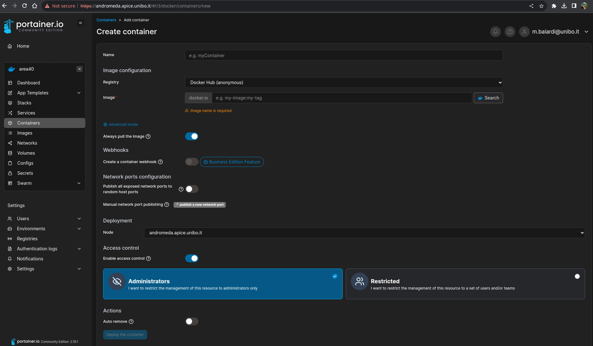
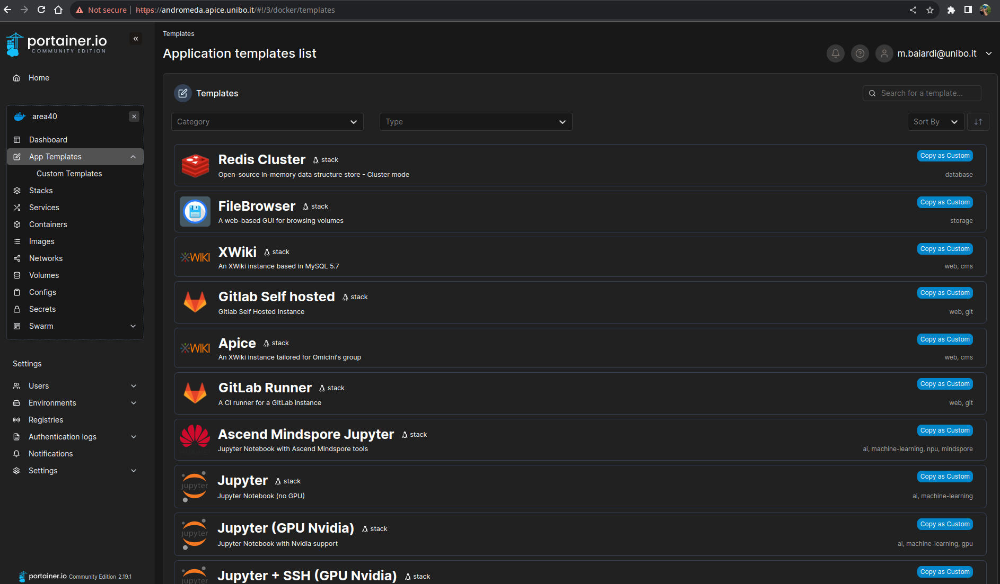

# How to deploy a container

Users can directly deploy a container using the Portainer dashboard, in the `Containers` menu entry.
After clicking on the `Add container` button, the user will be prompted to a container configuration page.
After filling out the form, the user can click on the `Deploy the container` button to deploy the container.

Two registries are currently available to pull images in Portainer: Docker Hub and Ascend Hub.
The latter is configured to the Huawei registry, which contains the Ascend images.

To better understand the configuration of a container, please refer to the [Docker documentation](https://docs.docker.com/engine/reference/run).

However, consider that if the container is restarted (e.g. after a reboot), the container will be restarted with the same configuration as the one provided in the form. 
This means that all the package installations made after the container creation will be lost. 
You can avoid this overcome in three ways:

1. Use `App Templates` which are pre-configured to contain the most common packages for data-scientist use cases, but also allow you to install additional packages that will persist after the possible reboot. This is the most recommended way to work inside the cluster.  
2. Build your own image, and push it to Docker Hub registry. Then you can deploy the container using this image. This is the recommended way to work inside the cluster if you need to install a lot of packages, and these are not available in the App Templates.
3. Consider allocating your volume as your home directory inside of the container, in this way all packages installed `locally` will persist after a reboot. This is not the recommended way to work inside the cluster; but works for the most simple use cases. 

!!! note
    Just remember that, in the third scenario, you need to specify that the installation is local for each package you install, for example, with `pip` you have to specify `pip install --user <package>`.

If you encounter problems with the deployment, you can also ask cluster administrators to provide you with a pre-configured container that satisfies your needs.

!!! note
    Inside of a Docker container you are logged as admin, and you can install whatever you want with the normal package manager (for instance, if the container is based on Ubuntu you can use `sudo apt install <package>`).

!!! note
    See [docker volumes](../explanation/docker-swarm.md#volumes) for more information about Docker volumes.

# App Templates

To ease the deployment of applications, several pre-configured Docker stacks are available inside of the Portainer dashboard. These templates are available in the `App Templates` menu entry, they are prepared to cover the most common use cases for data-scientist with the minimum configuration required.

# Secrets

If the template you chose uses a Jupyter Notebook, then it requires a Docker `secret` in order to configure a password for the notebook. To create a secret, you can go to the `Secrets` menu entry, and click on the `Add secret` button.

!!! seealso
    See [docker secrets](../explanation/docker-swarm.md#secrets) for more information about Docker secrets.