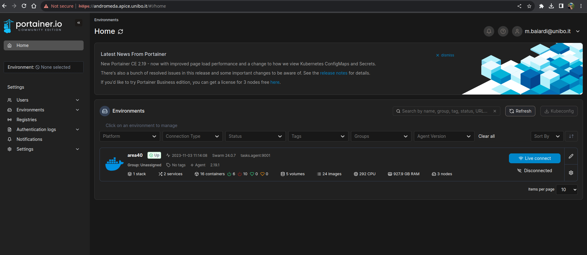
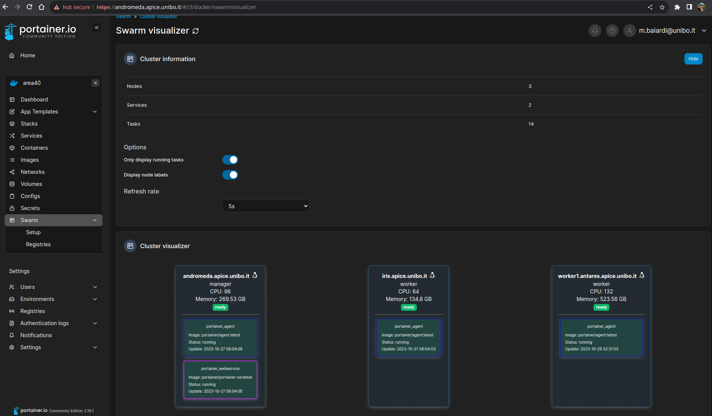

#Introduction

Cluster 4.0 provides a set of machines to be used to run research experiments. 
These machines are located in campus of Cesena.
Their resources are shared among all students and researchers, and exploitable through a cluster management system.
At the moment, the cluster management system is based on Docker Swarm, and available through the `Portainer Dashboard`. 

`Portainer` is a service that enables users to deploy containers in clusters through a web interface, providing also an access management system. Portainer manages many environments (i.e. clusters), and at the moment there is only one cluster available on the platform, which are visible through the `Cluster Visualizer` section inside the web dashboard.

All cluster’s machines are Linux servers.

!!! seealso
    To use this service, please read the [quickstart section](./quickstart.md).

!!! note
    The machines are not accessible from the outside, you need to be connected to the **campus of Cesena's VPN** network to access them.

!!! note
    Machines' resources are shared among all ALMAAI researchers, so unused containers should be removed to leave resources available to other users.
