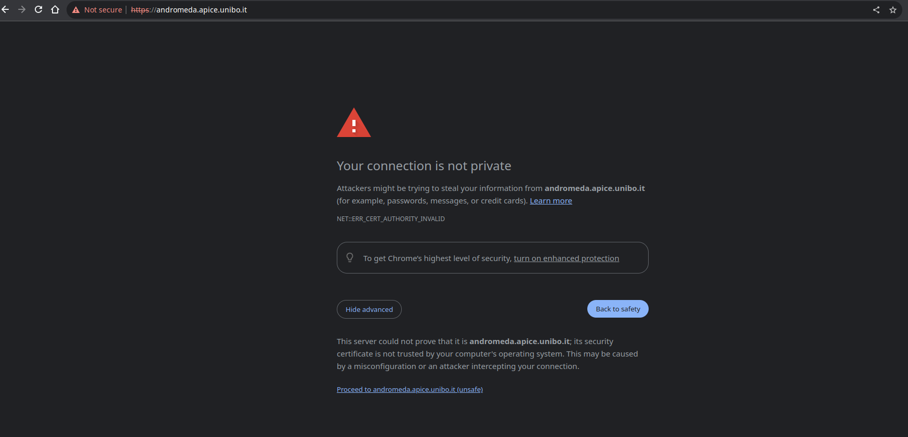

# Quickstart

## Prerequisites

The important aspects that need to be known, at least on a basic level, by cluster users are:

* [Docker](https://www.docker.com/) (Documentation [here](https://docs.docker.com/) - the basic commands are fine)
* [DockerSwarm](https://docs.docker.com/engine/swarm/)
* [Portainer](https://www.portainer.io/) (Documentation [here](https://docs.portainer.io/) that focus on the user-side concepts and how to deploy containers)
* Jupyter notebook (Google returns endless resources on this topic, for instance: [https://www.dataquest.io/blog/jupyter-notebook-tutorial/](https://www.dataquest.io/blog/jupyter-notebook-tutorial/), [https://towardsdatascience.com/a-beginners-tutorial-to-jupyter-notebooks-1b2f8705888a](https://towardsdatascience.com/a-beginners-tutorial-to-jupyter-notebooks-1b2f8705888a))

!!! note
    Consider reading [https://unibo-spe.github.io/09-containerization](https://unibo-spe.github.io/09-containerization)

## Use the cluster

1. Request access to the VPN and to the required cluster, [here](./how-to/request-access.md) is described how to do it.
2. Configure your environment to use the VPN, following the guide received by email.
3. Go to [https://andromeda.apice.unibo.it](https://clusters.almaai.unibo.it)
4. Select an environment (i.e. a cluster) from the available ones on which launch containers
5. Launch your Docker container following [good practices](./good-practices.md#good-practices).

!!! warning
    Each machine is configured to run updates every Sunday at 1:30 AM. Sometimes, the update process requires a reboot of the machine. If this happens, the machine will be unavailable for a few minutes. If you are running a job, it will be interrupted and you will have to restart it. Please, follow the [persistency good practices](good-practices.md#good-practices) in order to save your experiments results in a persistent volume.
    
!!! note
    The connection is provided by internal SSL certifiates, modern browsers try to block the connection to them. You have to explicitly declare, the first time you enter the URL described above, that you want to access the website.
    