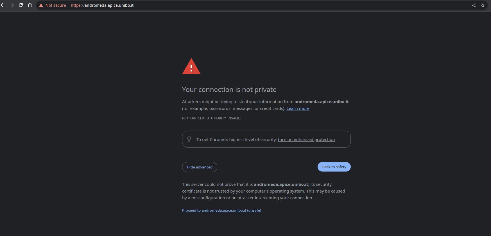

# Quickstart

## Prerequisites

Users are expected to have familiarity with the following concepts:

- Operating systems (preferably Linux)
- File systems and directories
- Command-line interfaces (CLI)
- Remote access tools (e.g., SSH)

Advanced system administration skills are not required, but will be helpful.

<!--
* [Docker](https://www.docker.com/) (Documentation [here](https://docs.docker.com/) - the basic commands are fine)
* [DockerSwarm](https://docs.docker.com/engine/swarm/)
* [Portainer](https://www.portainer.io/) (Documentation [here](https://docs.portainer.io/) that focus on the user-side concepts and how to deploy containers)
* Jupyter notebook (Google returns endless resources on this topic, for instance: [https://www.dataquest.io/blog/jupyter-notebook-tutorial/](https://www.dataquest.io/blog/jupyter-notebook-tutorial/), [https://towardsdatascience.com/a-beginners-tutorial-to-jupyter-notebooks-1b2f8705888a](https://towardsdatascience.com/a-beginners-tutorial-to-jupyter-notebooks-1b2f8705888a))

!!! note
    Consider reading [https://unibo-spe.github.io/09-containerization](https://unibo-spe.github.io/09-containerization)
-->

## Use the cluster

1. Request access to the VPN and to the required cluster, [here](./how-to/request-access.md) is described how to do it.
2. Ask your supervisor to assign to you a MAC address to be used by your containers. Without this, you will not be able to create one. Your supervisor can use this website to assign you a MAC address: [https://padfy.campusfc.unibo.it/](https://padfy.campusfc.unibo.it/).
3. Configure your environment to use the VPN, following the guide received by email.
4. Go to [https://andromeda.apice.unibo.it:8006](https://andromeda.apice.unibo.it:8006) and log in with institutional credentials (the same used for the VPN).
5. [Deploy your container](./how-to/deploy-container.md) following [good practices](./good-practices.md#good-practices).

<!--
!!! warning
    Each machine is configured to run updates every Sunday at 1:30 AM. Sometimes, the update process requires a reboot of the machine. If this happens, the machine will be unavailable for a few minutes. If you are running a job, it will be interrupted and you will have to restart it. Please, follow the [persistency good practices](good-practices.md#good-practices) in order to save your experiments results in a persistent volume.
-->

!!! note
    The connection is provided by internal SSL certifiates, modern browsers try to block the connection to them. You have to explicitly declare, the first time you enter the URL described above, that you want to access the website.
    